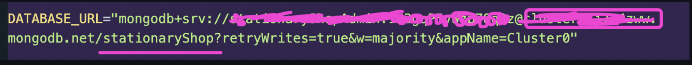

# Mehnoor Library

## 🟪 How to setup the project locally

First make sure you have `node` installed in your machine.

Check it using this command on the terminal:

```
node -v
```

If, node is not installed, install it following the guideline and install the LTS(Long term support) version of it.

https://nodejs.org/en

If node version is found then:

### 👉 Step 1: Download or Clone the GitHub repository

Clone command:

```
git clone <repository-url>
```

### 👉 Step 2: Open the project folder in the terminal

Go to the folder and open it in the terminal.

You can also open the folder using the terminal by following command:

```
cd <project-folder-name>
```

### 👉 Step 3: Install dependencies

Run the following command:

```
npm install
```

It will download all the necessary node packages needed for the project.

### 👉 Step 4: Open the folder using VSCode or any of your preferred code editor.

Manually open the folder in your editor or you can use this command to open:

```
code .
```

### 👉 Step 5: Create a `.env` file in the root folder

Create a `.env` and add your mongoDB url and port number.

```
PORT=give your port number here

DATABASE_URL=give your mongo db uri here.
```

For database url make sure to mention your database name(the one you want to create) shown below:



### 👉 Step 6: Run the following commands according to your requirements:

#### 1. To start server locally:

```
npm run dev
```

#### 2. to convert all the TypeScript files into JavaScript files (which will be stored in the dist folder):

```
npm run build
```
